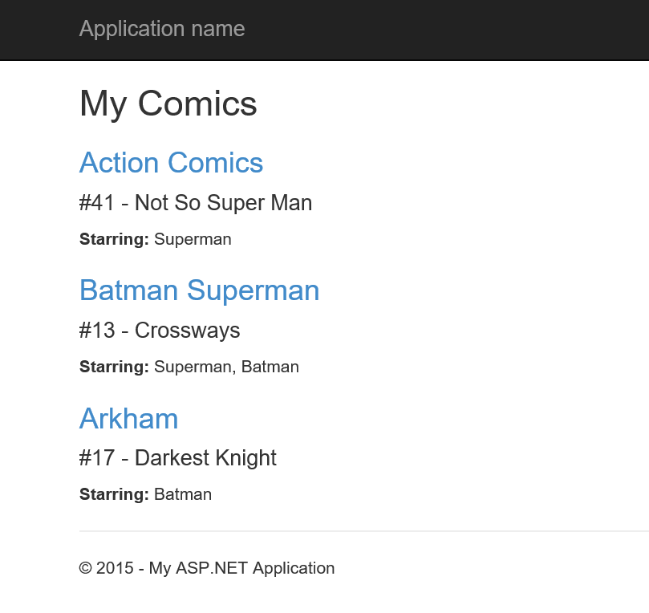
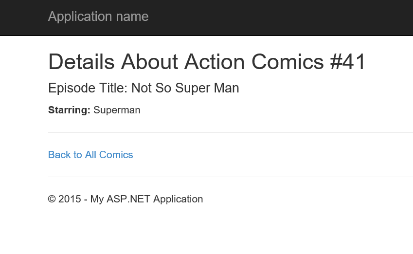

# ChallengeComicBooks
MVC Project

I created this project as part of the C# MVC course at The Tech Academy in which I was provided with a model and tasked with building an MVC application around it which provided master and detail views. My work can be seen in FirstChallenge.sln found in folder FirstChallenge.

<h3>Master View:</h3>

<h3>Detail View:</h3>

